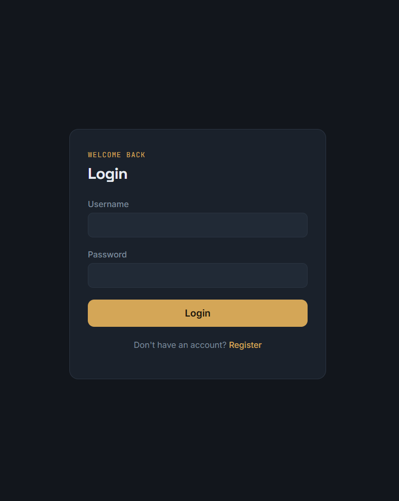
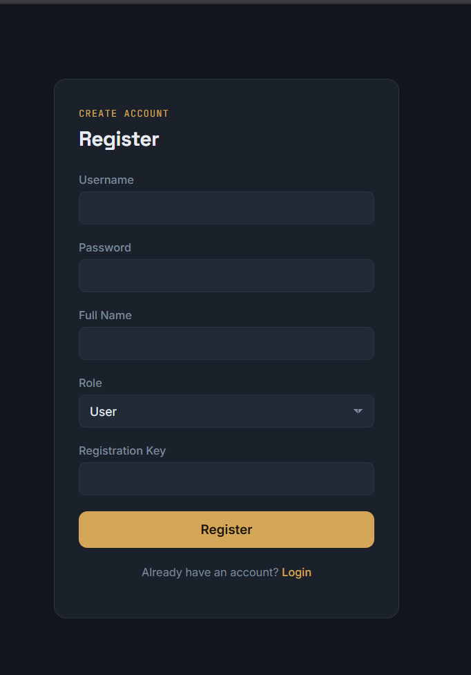
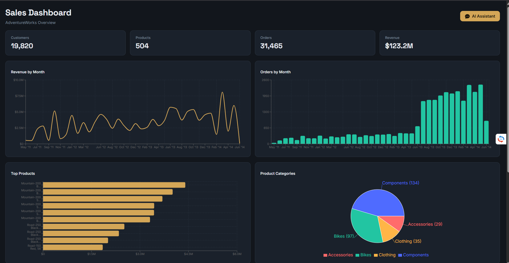
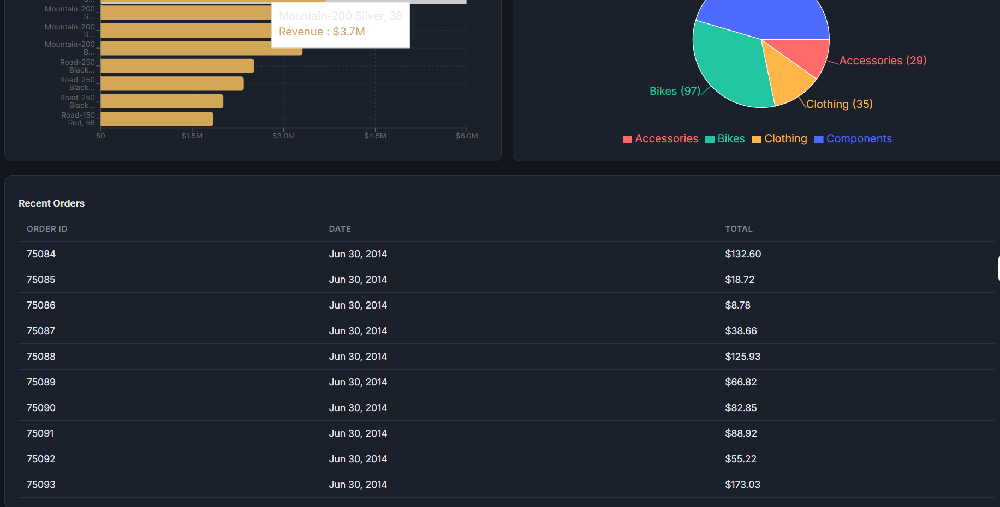
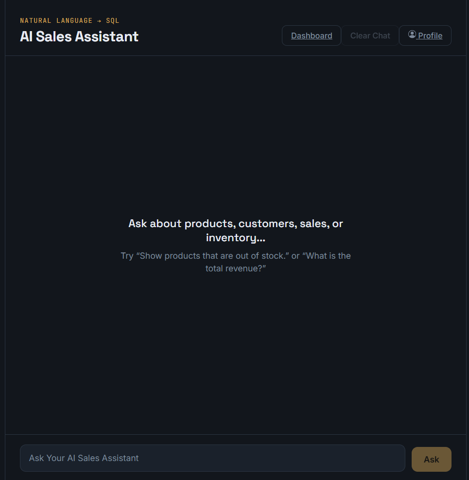
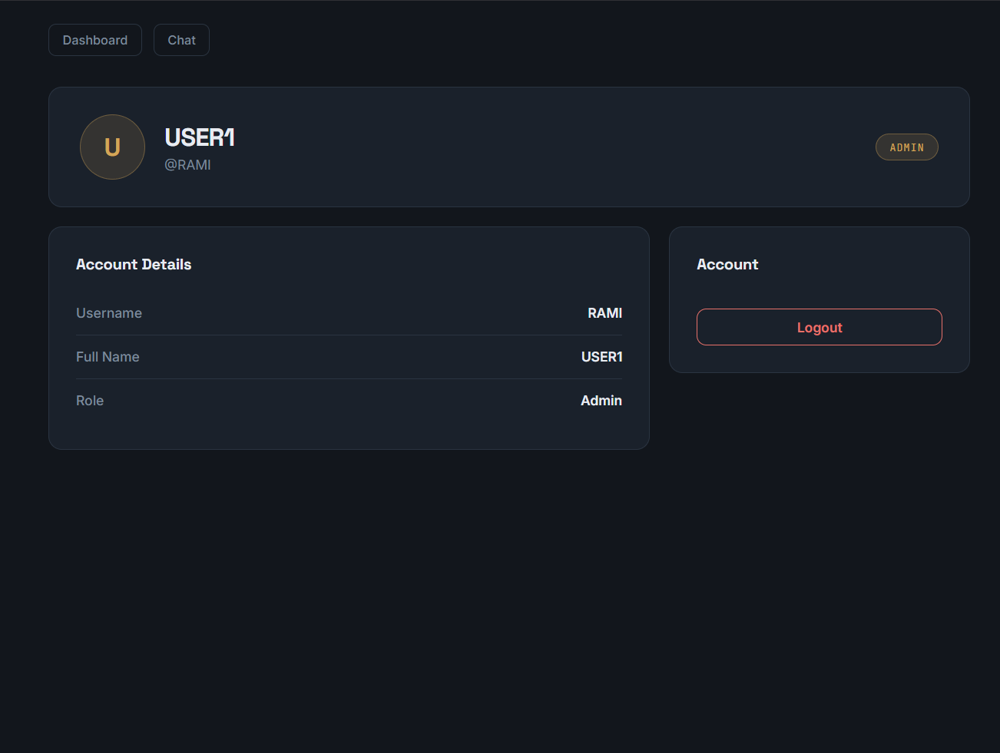

# NL2SQL Insight – Natural Language to SQL

An AI-powered business intelligence web application that enables users to query a SQL Server database using natural language. The system leverages a Large Language Model (LLM) to translate user questions into SQL queries, executes them against the AdventureWorks2022 database, and presents both textual answers and interactive business dashboards.

The application also includes a complete JWT authentication system with secure login, user registration, role-based authorization, and protected API endpoints.

---

# Features

## AI Features

- Natural Language → SQL generation
- AI-generated business insights
- AI-generated SQL query visualization
- Local LLM using Ollama
- SQL execution on AdventureWorks2022

## Dashboard

- Interactive business dashboard
- KPI cards
- Revenue by month
- Orders by month
- Top selling products
- Product categories
- Recent orders table

## Authentication

- User registration
- Secure user login
- Password hashing
- JWT authentication
- Protected API endpoints
- Protected React routes
- User profile
- Logout
- Role-based authorization (Admin/User)

## Frontend

- Modern React UI
- React Router
- Local chat history
- Responsive charts
- Authentication context

---

# System Architecture

```
                     React (Vite)
                           │
                           ▼
                  ASP.NET Core Web API
                    │             │
                    │             │
          Authentication      Business APIs
                    │             │
                    ▼             ▼
              SQL Server      FastAPI Service
                                  │
                                  ▼
                           Ollama (Qwen2.5)
                                  │
                                  ▼
                    AdventureWorks2022 Database
```

---

# Technologies

## Frontend

- React
- Vite
- React Router
- Axios
- Recharts
- CSS

## Backend

- ASP.NET Core Web API
- JWT Authentication
- PasswordHasher
- FastAPI
- Python

## AI

- Ollama
- Qwen2.5-Coder 7B

## Database

- Microsoft SQL Server
- AdventureWorks2022

---

# Authentication Architecture

```
React Login
      │
      ▼
POST /auth/login
      │
      ▼
AuthController
      │
      ▼
UserService
      │
      ▼
SQL Server (Users)
      │
Verify Password Hash
      │
      ▼
JwtService
      │
Generate JWT
      │
      ▼
React stores Token
      │
      ▼
Protected API Requests
      │
Authorization: Bearer <JWT>
      │
      ▼
Protected Controllers
```

---

# Project Structure

```
AI-Sales-Assistant
│
├── Frontend (React)
│   │
│   ├── pages
│   │     ├── Login
│   │     ├── Register
│   │     ├── Profile
│   │     ├── Chat
│   │     └── Dashboard
│   │
│   ├── api
│   │     └── authApi.js
│   │
│   ├── services
│   │     └── authService.js
│   │
│   ├── context
│   │     └── AuthContext.jsx
│   │
│   └── components
│         └── ProtectedRoute.jsx
│
├── ASP.NET Core API
│   │
│   ├── Controllers
│   │     ├── AuthController
│   │     ├── ProfileController
│   │     ├── ChatController
│   │     └── DashboardController
│   │
│   ├── Services
│   │     ├── UserService
│   │     ├── JwtService
│   │     ├── ChatService
│   │     └── DashboardService
│   │
│   ├── Models
│   │     ├── User
│   │     ├── LoginRequest
│   │     ├── LoginResponse
│   │     └── RegisterRequest
│   │
│   └── Program.cs
│
├── FastAPI
│   ├── SQL Generation
│   ├── SQL Validation
│   ├── SQL Execution
│   ├── AI Response Generation
│   └── Dashboard Analytics
│
└── SQL Server
      ├── AdventureWorks2022
      └── Users
```

---

# Dashboard

The dashboard displays real-time business analytics including:

- Total Customers
- Total Products
- Total Orders
- Total Revenue
- Revenue by Month
- Orders by Month
- Top Selling Products
- Product Categories
- Recent Orders

---

# Authentication

## Registration

```
POST /auth/register
```

Creates a new user after validating a secure registration key.

Passwords are stored using ASP.NET PasswordHasher.

---

## Login

```
POST /auth/login
```

Authenticates a user and returns a JWT token.

---

## Profile

```
GET /profile
```

Returns information about the authenticated user.

Requires:

```
Authorization: Bearer <JWT>
```

---

# API Endpoints

## Chat

```
POST /chat
```

Example

```json
{
    "question":"What is the total revenue?"
}
```

Response

```json
{
    "generated_sql":"SELECT ...",
    "answer":"The total revenue is ..."
}
```

---

## Dashboard

```
GET /dashboard
```

Returns dashboard analytics used by the React dashboard.

---

## Authentication

### Login

```
POST /auth/login
```

### Register

```
POST /auth/register
```

### Profile

```
GET /profile
```

Protected using JWT Authentication.

---

# Running the Project

## 1. Clone Repository

```bash
git clone https://github.com/yourusername/AI-Sales-Assistant.git
```

---

## 2. Install Frontend

```bash
cd Frontend

npm install

npm run dev
```

Runs on:

```
http://localhost:5173
```

---

## 3. Run ASP.NET Core API

```bash
dotnet run
```

Runs on:

```
http://localhost:5097
```

---

## 4. Run FastAPI

```bash
uvicorn main:app --reload
```

Runs on:

```
http://localhost:8000
```

---

## 5. Start Ollama

```bash
ollama run qwen2.5-coder:7b
```

---

# Example Questions

- What is the total revenue?
- Show products that are out of stock.
- List the top 10 customers by sales.
- Show monthly sales.
- Which products generated the highest revenue?
- How many orders were placed this year?
- Which product category has the most products?

---

# Security

The application implements several security features:

- JWT Authentication
- Password Hashing
- Protected API Endpoints
- Protected React Routes
- Role-Based Authorization
- Registration Key Validation
- Parameterized SQL Queries

---

# Future Improvements

- Export reports to Excel
- Export reports to PDF
- Conversation history stored in SQL Server
- User management dashboard
- Refresh Tokens
- JWT expiration handling
- Docker deployment
- Cloud deployment (Azure)

---

# Screenshots


- Login

- Register

- Dashboard


- Chat

- Profile


---

# Author

**Souha Hammami**

Internship Project

AI Sales Assistant using React, ASP.NET Core, FastAPI, Ollama, and SQL Server.
